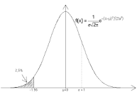
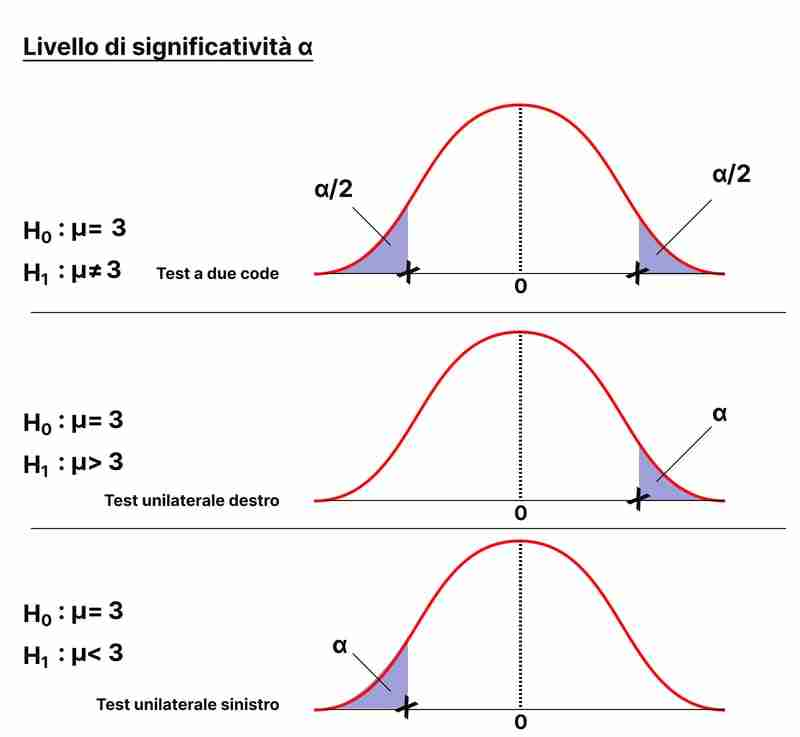
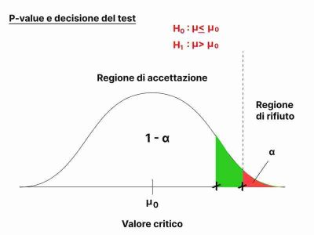
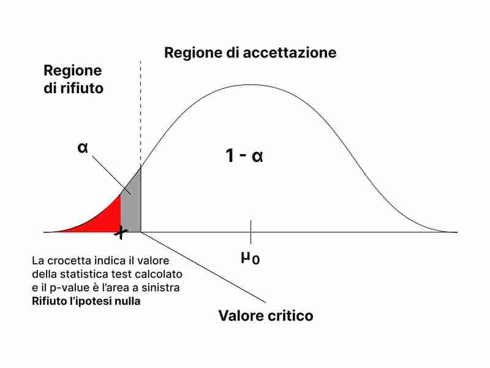
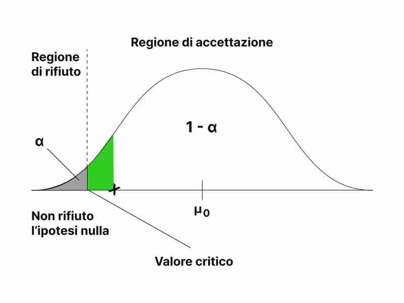

# Seconda parte

```{r}
library(ggplot2)

```

# Introduzione

L'indagine statistica è sempre effettuata su un insieme di entità (individui, oggetti,. . .) su cui si manifesta il fenomeno che si studia. Questo insieme è detto popolazione o universo e può essere costituito da un numero finito oppure infinito di unità; nel primo caso si parla di popolazione finita e nel secondo caso di popolazione illimitata. La conoscenza delle caratteristiche di una popolazione finita può essere ottenuta osservando la totalità delle entità della popolazione oppure un sottoinsieme di questa, detto campione estratto dalla popolazione. Una popolazione illimitata può invece essere studiata soltanto tramite un campione estratto dalla popolazione. Di particolare importanza in statistica è l'inferenza statistica. Essa ha lo scopo di estendere le misure ricavate dall'esame di un campione alla popolazione da cui il campione è stato estratto.

L'inferenza statistica si basa su due metodi fondamentali di indagine: la stima dei parametri e la verifica delle ipotesi.

### Stima dei parametri

La stima dei parametri ha lo scopo di determinare i valori non noti dei parametri di una popolazione (come il valore medio, la varianza,. . .) per mezzo dei corrispondenti parametri derivati dal campione estratto dalla popolazione (come la media campionaria, la varianza campionaria,. . .). Si possono usare stime puntuali o stime per intervallo.

Si parla di stima puntuale quando si stima un parametro non noto di una popolazione usando un singolo valore reale.

Alla stima puntuale di un parametro non noto di una popolazione (costituita da un unico valore) spesso si preferisce sostituire un intervallo di valori, detto intervallo di confidenza, ossia si cerca di determinare in base al campione osservato (x1, x2, . . . , xn) due limiti (uno inferiore e uno superiore) entro i quali sia compreso il parametro non noto con un certo grado di confidenza, detto anche grado di fiducia.

### Verifica delle ipotesi

La verifica delle ipotesi è un procedimento che consiste nel fare una congettura o un'ipotesi sul parametro non noto $\theta$ o sulla distribuzione di probabilità e nel decidere, sulla base del campione estratto se essa è accettabile.

## Variabili aleatorie discrete

Una variabile discreta può assumere un numero finito di valori reali (e, in tal caso, gli eventi elementari da cui deriva costituiscono l'elenco finito dei possibili risultati di una prova) oppure un numero infinito numerabile (e, in tal caso gli eventi elementari possono essere messi in corrispondenza con gli elementi della serie dei numeri naturali $1,2,…i,..$)

Un variabile discreta è nota se si conoscono i valori che può assumere e le rispettive probabilità, cioè se sono ordinatamente note le seguenti informazioni:

|                   |       |       |     |       |     |
|-------------------|-------|-------|-----|-------|-----|
| ***Valori di X*** | $x_1$ | $x_2$ | ... | $x_i$ | ... |
| ***Probabilità*** | $p_1$ | $p_2$ | ... | $p_i$ | ... |

La tabella precedente viene definita *distribuzione della probabilità della variabile casuale discreta X* e rappresenta un insieme di informazioni necessarie e sufficienti per calcolare la probabilità di qualsiasi evento concernente la v.c X.

Pertanto condizione necessaria e sufficiente affinché una v.c discreta X sia ben definita è che tali probabilità soddisfino le seguenti condizioni:

$$p_i ≥ 0, ∀_i = 1,2,...;$$

$$\sum_{i=1}^∞ p_i=1$$

Si noti che nessun vincolo viene imposto sui valori reali che una v.c può assumere. La rappresentazione grafica più naturale di una v.c. discreta è quella di porre in ascissa i valori $(x_i, x_2,…)$ che la v.c. può assumere ed in ordinata le corrispondenti probabilità $(p_1p_2,…)$, secondo la Figura seguente:


la *funzione di ripartizione* $F(x_0)$ di una variabile casuale X discreta calcolata nel punto $x_0$ è :

$$F(x_0) = Pr(X ≤ x_0) = \sum_{x ≤ x_0} p_i$$

Il sistema R mette a disposizione per ciascuna delle principali variabili aleatorie discrete:

• la funzione di probabilità indicata con *d* calcola la funzione di probabilità di una variabile aleatoria in uno specifico punto o in un insieme di punti (density mass).

• la funzione di distribuzione indicata con *p* calcola la funzione di distribuzione di una variabile aleatoria in uno specifico punto o in un insieme di punti (probability distribution).

• la funzione per calcolare i quantili indicata con *q* e calcola i quantili.

• la funzione che simula la variabile aleatoria mediante la generazione di sequenze di numeri pseudocasuali indicata con *r* simula una variabile aleatoria generando una sequenza di numeri pseudocasuali.

Tra le variabili casuali discrete rientrano: Discrete: Bernoulli, binomiale, geometrica (geometrica modificata), binomiale negativa (binomiale negativa modificata), Poisson, ipergeometrica;

## Variabili aleatorie continue

Una variabile aleatoria è continua se può assumere tutti i valori compresi in un (qualsiasi) intervallo reale. Formalmente, una v.c. continua X *assume un insieme continuo di valori con una densità di probabilità* $f_X(x)$, è una funzione misurabile e a valori reali che assegna ad ogni evento di uno spazio di probabilità continuo un numero reale.

Le v.c. continue presentano una maggiore complessità analitica poiché per esse non è possibile elencare tutti i valori che la v.c. assume, essendo questi una infinità non numerabile. Occorre quindi assegnare la probabilità ad intervalli sulla retta e derivare,poi, da tale assegnazione tutte le probabilità degli eventi che interessano.

In prima istanza, tale assegnazione sembrerà astratta e poco collegata alla specifica prova ma, più oltre, si vedrà come l'introduzione di una probabilità per gli intervalli è strettamente derivata dalla natura e dalla specificità della prova.

Una v.c. continua X è nota se, per ogni $x_0$ reale e prefissato, è nota la probabilità che tale v.c. assuma un valore in un intervallo di ampiezza infinitesimo rispetto a $x_0$ mediante la relazione seguente:

$$P_r(x_0 < X ≤ x_0 + d_x) = f(x_0)dx$$

dove $f(x)$ è una funzione a valori reali, detta *funzione di densità* della v.c. continua X. Spesso, scriveremo: $X \sim f(x)$ per indicare che la v.c. X possiede $f(x)$ come propria funzione di densità.


La probabilità che la v.c X assuma valori nell'intervallo raffigurata è uguale a $f(x)dx$ perchè essa è uguale all'aerea del rettangolo la cui base misura $dx$ e la cui altezza è $f(x_0)$, perchè per la continuità deve essere: $f(x_0) = f(x_0 + dx)$.

la *funzione di ripartizione* $F(x_0)$ di una variabile casuale X continua calcolata nel punto $x_0$ è :

$$F(x_0) = Pr(X ≤ x_0) = \int^{x_0}_{-\infty} f()wd_w$$

Il sistema R mette a disposizione per ciascuna delle principali variabili aleatorie discrete:

• la funzione di probabilità indicata con *d* calcola la funzione di probabilità di una variabile aleatoria in uno specifico punto o in un insieme di punti (density mass).

• la funzione di distribuzione indicata con *p* calcola la funzione di distribuzione di una variabile aleatoria in uno specifico punto o in un insieme di punti (probability distribution).

• la funzione per calcolare i quantili indicata con *q* e calcola i quantili.

• la funzione che simula la variabile aleatoria mediante la generazione di sequenze di numeri pseudocasuali indicata con *r* simula una variabile aleatoria generando una sequenza di numeri pseudocasuali.

Tra le variabili casuali discrete rientrano: Continue: uniforme, esponenziale, normale, chi-quadrato, di Student.

In questo progetto analizzeremo a fondo la *variabile casuale continua Normale*.

## Variabile casuale normale

La v.c. Normale è di gran lunga la distribuzione più importante del Calcolo delle probabilità e della Statistica, al punto che appare difficile immaginare lo sviluppo di tali discipline senza riconoscere ad essa un ruolo centrale. La sua stessa denominazione (*normale* suggerisce che essa è la "norma") esplicita che la sua presenza nelle applicazioni e negli sviluppi teorici è quasi una regola. In effetti, la v.c. Normale approssima la distribuzione empirica di moltissimi fenomeni reali, ma è anche punto di riferimento per stabilire confronti, dedurre risultati asintotici e controllare allontanamenti dalla distribuzione di tale v.c.

-   La sua introduzione nella storia della probabilità è legata alla ricerca della distribuzione degli errori accidentali. Galileo descrisse con precisione, sin dal 1632, le caratteristiche essenziali che una distribuzione degli errori doveva possedere nel "dialogo dei massimi sistemi" ma non si preoccupò di derivarne la forma analitica.

-   La prima apparizione della funzione di densità della v.c. Normale avviene nel 1733 ad opera di *De Moivre* che la utilizza come approssimazione alla somma di v.c. Binomiali. Negli anni 1770-71 Daniel Bernoullli fornisce la prima tavola della funzione di densità mentre Laplace a partire dal 1810 la ritrova nei Teoremi Limite Centrale.

-   Nel 1809 Gauss pubblica la "Theoria Motus Corporum Coelestium" dove utilizza la v.c. Normale nell'ambito del principio dei minimi quadrati e del metodo della massima verosimiglianza. Gauss in tale opera dichiara di aver utilizzato questi risultati sin dal 1795. Questa affermazione, e l'autorità indiscussa di Gauss nell'ambito delle scienze matematiche, hanno indotto a definire la v.c. Normale come v.v. di Gauss o v.c. Gaussiana.

-   Grazie ai Teoremi Limite Centrale, e alle interpretazioni estensive che ne furono date, la v.c. Normale non fu applicata alle sole misurazioni fisiche. Quételet nel 1846 la utilizzò per studi antropometrici, Maxwell nel 1860 per la teoria cinetica dei gas, Galton nel 1889 per lo studio dei fenomeni naturali e biologici. Quindi a partire dagli inizi del 1900, Student, Pearson e Fisher posero le basi inferenziali della Statistica mediante il campionamento, la stima e il test soprattutto per popolazioni estratte da v.c. Normali e derivarono quelle distribuzioni notevoli, esatte o asintotiche, che oggi utilizziamo.

*A titolo di curiosità, si può ricordare che la funzione di densità della v.c. Normale è l'unica formula matematica che, nella storia, sia stata impressa su una banconota con ampia circolazione.*

La distribuzione normale è una delle distribuzioni più comuni e importanti della statistica. È una distribuzione continua, che significa che può assumere qualsiasi valore all'interno di un intervallo specifico, anziché solo valori discreti. La distribuzione normale è descritta da una curva a campana, con la maggior parte dei valori concentrati intorno alla media e i valori estremi che diventano meno probabili man mano che ci si allontana dalla media.

La media (o la mediana) di una distribuzione normale è il valore centrale della distribuzione e rappresenta il valore più probabile. La deviazione standard è una misura della dispersione dei dati intorno alla media. La distribuzione normale standard ha una media di 0 e una deviazione standard di 1.

La distribuzione normale ha molte proprietà utili, tra cui:

-   La somma di molte variabili casuali indipendenti normalmente distribuite è anche normalmente distribuita.

-   La distribuzione normale è una distribuzione di probabilità stabile, cioè una piccola quantità di dati casuali può essere utilizzata per stimare i parametri della distribuzione.

-   La distribuzione normale è utilizzata come base per un gran numero di test statistici, come test t, analisi di varianza, analisi dei componenti principali.

La distribuzione normale è utilizzata in molte applicazioni, tra cui:

-   Modelli di previsione basati sull'inferenza statistica, come la previsione del tempo o del prezzo delle azioni

-   Modelli di simulazione, come la simulazione delle prestazioni delle attrezzature o del traffico

-   Modelli di stima, come l'analisi delle risposte a un questionario

-   Modelli di ottimizzazione, come il calcolo del prezzo di un'opzione

-   La distribuzione normale è spesso considerata un buon modello per variabili fisiche come peso, altezza, temperatura, voltaggio, livello di inquinamento, per analizzare gli errori di misurazione ed anche per descrivere il reddito familiare o voti degli studenti.

Una v.c. *X* continua si dice v.c. Normale (oppure v.c. Gaussiana) con parametri $\mu$ ,per indicare la media, e $\sigma^2$ ,per indicare la varianza, e la si indica con $X \sim N(\mu, \sigma^2)$, se è definita su tutto l'asse reale mediante funzione di densità:

$$
f(x) = \frac{1}{\sqrt{2\pi \sigma^2}} e^{(-\frac{1}{2} \frac{(x-\mu)^2}{\sigma^2})}
$$

con $- \infty < x < \infty$

Poiché il parametro $\mu$ può assumere qualsiasi valore reale mentre il parametro $\sigma^2$ può solo essere non negativo, lo spazio parametrico di questa v.c. è il semipiano positivo, cioè:

$$\Omega(\mu,\sigma^2) = {(\mu,\sigma^2): -\infty < \mu < +\infty; 0 ≤ \sigma^2 < +\infty} $$

Lo studio analitico della funzione di densità di una v.c. Normale mostra che essa ha una forma campanulare simmetrica rispetto al suo valore medio (punto di ascissa $x=\mu$ ), in corrispondenza del quale si presenta il massimo ovvero $f(x)=\frac{1}{\sigma\sqrt{2 \pi}}$. Quindi, il parametro $\mu$ è la moda, la mediana e il valore medio della v.c. *X*. Utilizzando le derivate seconde, si dimostra che $f(x)$ presenta due flessi equidistanti dal punto $x=\mu$ in corrispondenza delle ascisse $x = \mu \pm \sigma$. Inoltre, $f(x) -> 0$ per $x -> \pm \infty$, cioè l'asse x è un asintoto orizzontale per tale funzione.

Se, a parità di $\sigma^2$, si modifica il valore medio $\mu$, allora la funzione di densità della v.c. subisce una traslazione lungo l'asse x.

Invece al crescere di $\sigma^2$, a parità di $\mu$ i flessi si allontanano dalla media, dunque da ($\mu$) , e la funzione di densità attribuisce una maggiore probabilità che la v.c. assuma valori attorno al valore medio $\mu$.

Infine quando $\sigma^2 -> 0$, la distribuzione della v.c. Normale tende a divenire degenere perchè assume, con probabilità 1, valori infinitamente vicini a $x=\mu$.

I momenti caratteristici della v.c. Normale risultano uguali a:

$$
E(X) = \mu; Var(X) = \sigma^2; Asym(X) = 0; Kurt(X)=3
$$

-   Grazie a tali caratteristiche, spesso si afferma che se una v.c. presenta una forma simmetrica e una curtosi vicina a 3 essa può essere approssimata da una v.c. Normale di uguale valore medio e varianza. In effetti, tale approssimazione non è rigorosa ma, se la v.c. presenta una sola moda, essa può essere applicata nella maggior parte dei casi.



In R la densità normale si calcola attraverso la funzione:

```{r}
curve(dnorm(x,mean =0, sd =1), from =-6, to=6, xlab="x", ylab="f(x)", lty =1)

```

dove:

-   x è il valore assunto (o i valori assunti) dalla variabile aleatoria normale;

<!-- -->

-   mean e sd sono il valore medio e la deviazione standard della densità normale.

Variazioni del parametro *μ* comportano traslazioni della curva lungo l'asse delle ascisse; infatti, al crescere del parametro *μ* la curva si sposta lungo l'asse delle ascisse senza cambiare forma, ecco un esempio:

```{r}
curve(dnorm(x,mean =-2, sd =1), from =-6, to=6, xlab="x", ylab="f(x)", lty =1, col = "blue")

curve(dnorm(x,mean =0, sd =1), from =-6, to=6, xlab="x", ylab="f(x)", lty =1, add = TRUE)

curve(dnorm(x,mean =2, sd =1), from =-6, to=6, xlab="x", ylab="f(x)", lty =1, add= TRUE, col = "red")

```

Nel grafico la curva di colore rosso ha un valore di $\mu=2$ (pari a due) ed è traslata verso destra rispetto alla curva di partenza, invece la curva di colore blu ha $\mu=-2$ dunque negativo infatti è spostata verso sinistra.

Il parametro $\sigma$, pari alla semiampiezza tra i due punti di flesso, caratterizza invece la larghezza della funzione.

```{r}
curve(dnorm(x,mean =0, sd =1), from =-6, to=6, xlab="x", ylab="f(x)", lty =1, col = "blue")

curve(dnorm(x,mean =0, sd =3), from =-6, to=6, xlab="x", ylab="f(x)", lty =1, add = TRUE)

curve(dnorm(x,mean =0, sd =5), from =-6, to=6, xlab="x", ylab="f(x)", lty =1, add= TRUE, col = "red")

```

All'aumentare del valore di $\sigma$ la curva tende a diventare più piatta, infatti la curva di colore rosso che ha $\sigma=5$ è di gran lunga più schiacciata rispetto a quella di colore blu con $\sigma=1$, se, invece, il valore di $\sigma$ diminuisce la curva si allungherà verso l'alto restringendosi contemporaneamente ai lati.

### Variabile casuale normale standardizzata

Una variabile aleatoria normale standard, solitamente denotata con Z, può essere ottenuta da una variabile aleatoria normale non standard $X ∼ N(μ, σ)$ standardizzando, ossia sottraendo il valore medio e dividendo per la deviazione standard: $$Z = \frac{X-\mu}{\sigma}$$ da cui segue $X = μ + σ Z$.

Dunque $Z \sim N(0,1)$ è la v.c. *Normale standardizzata,* ossia una normale con valore medio nullo e varianza unitaria, la cui funzione di distribuzione è $\Phi(z)$: $$
\Phi(z) = 
\frac{1}{\sqrt{2\pi}}
\int^z_{-\infty} e^{-\frac{y^2}{2}}
$$

La funzione di distribuzione della v.c. *Z* non ammette una formulazione esplicita, per cui è stato necessario predisporre delle tavole che, per opportuni valori di z forniscano l'integrale $\Phi(z)$ con sufficiente accuratezza.

In R la funzione di distribuzione di una variabile $X ∼ N(μ, σ)$ si calcola tramite la funzione:

```{r}
curve(pnorm(x, mean = 0, sd = 0.5, lower.tail = TRUE), from = -4, to = 4, xlab = "x", ylab ="P(X≤x)", main="media=0; sd =0.5, 1, 1.5",lty =2, col = "blue")

curve(pnorm(x, mean = 0, sd = 1, lower.tail = TRUE), add =TRUE)

curve(pnorm(x, mean =0, sd =1.5, lower.tail = TRUE), add =TRUE, lty =3, col = "red")

```

dove:

\- x è il valore assunto (o i valori assunti) dalla variabile aleatoria normale;

\- mean e sd sono il valore medio e la deviazione standard della densità normale;

\- lower.tail se tale parametro è TRUE (caso di default) calcola $P(X ≤ x)$, mentre se tale parametro è FALSE calcola $P(X > x)$.

### Regola del 3 $\sigma$

#### Introduzione della variabile casuale binomiale

#### Approssimazione della distribuzione binomiale con la distribuzione normale

#### Approssimazione della distribuzione di somme di variabili aleatorie indipendenti

#### Introduzione della variabile casuale poisson

#### Approssimazione della distribuzione di Poisson con la distribuzione normale

## 10 Stima puntuale

#### Campioni casuali e stimatori

In statistica, un campione casuale è un insieme di elementi scelti in modo casuale da una popolazione. Gli stimatori sono delle funzioni matematiche che utilizzano i dati del campione per fornire informazioni sulla popolazione di origine. Esistono diversi tipi di stimatori, come gli stimatori puntuali, che forniscono un valore preciso per un parametro della popolazione, e gli stimatori intervallari, che forniscono un intervallo di valori in cui si presume che si trovi il valore del parametro. L'accuratezza degli stimatori dipende dalla dimensione del campione e dalla distribuzione dei dati nella popolazione.

Per ottenere informazioni sui parametri non noti della popolazione, si può fare uso dell'inferenza statistica considerando un campione estratto dalla popolazione e effettuando su tale campione delle opportune misure. Affinché le conclusioni dell'inferenza statistica siano valide il campione deve essere scelto in modo da essere rappresentativo della popolazione. Molti metodi dell'inferenza statistica sono basati sull'ipotesi di campioni casuali.

Nei metodi di indagine dell'inferenza statistica si considera un campione casuale $X1,X2, . . . ,Xn$ di ampiezza n estratto dalla popolazione e si cerca di ottenere informazioni sui parametri non noti facendo uso di alcune variabili aleatorie, che sono funzioni misurabili del campione casuale, dette *statistiche* e *stimatori*.

Una **statistica** $t(X_1,X_2, . . . ,X_n)$ è una funzione misurabile e osservabile del campione casuale $X_1,X_2, . . . ,X_n$. Essendo la statistica osservabile, i valori da essa assunti dipendono soltanto dal campione osservato $(x1, x2, . . . , xn)$ estratto dalla popolazione e i parametri non noti sono presenti soltanto nella funzione di distribuzione della statistica.

Uno **stimatore** $\hat\Theta = t(X_1,X_2, . . . ,X_n)$ è una funzione misurabile e osservabile del campione casuale $X_1,X_2, . . . ,X_n$ i cui valori possono essere usati per stimare un parametro non noto $\theta$ della popolazione. I valori $\hat\theta$ assunti da tale stimatore sono detti stime del parametro non noto $\theta$.

Statistiche tipiche sono la media campionaria e la varianza campionaria.

### Metodi per la ricerca di stimatori

I principali metodi di stima puntuale dei parametri sono:

#### metodo dei momenti

Il metodo dei momenti è un metodo utilizzato in statistica per stimare i parametri di una distribuzione. Consiste nell'utilizzare i momenti della distribuzione campionaria per stimare i momenti della distribuzione della popolazione, e quindi utilizzare questi ultimi per stimare i parametri della popolazione.

Il metodo dei momenti è uno dei più antichi metodi di stima dei parametri. Per illustrarlo occorre in primo luogo definire i momenti campionari.

Il primo momento di una distribuzione è la *media*, che fornisce informazioni sul valore atteso della distribuzione. Il secondo momento è la *varianza*, che fornisce informazioni sulla dispersione dei dati intorno alla media. I momenti di ordine più elevato forniscono informazioni supplementari sulla forma della distribuzione.

**Definizione 10.4**: Si definisce momento campionario r--esimo relativo ai valori osservati $(x1, x2, . . . , xn)$ del campione casuale il valore:

$$
M_r(x_1,x_2,...,x_n) = \frac{1}{n}\sum_{i=1}^n x_i^r$$

con $(r=1,2,…)$

Si nota quindi che il momento campionario r--esimo è la media aritmetica delle potenze r--esime delle $n$ osservazioni effettuate sulla popolazione. In particolare, se $r = 1$ il momento campionario $M1(x1, x2, . . . , xn)$ coincide con il valore osservato della media campionaria $X$, ossia $M1 = (x1 + x2 + . . . + xn)/n$.

Se esistono $k$ parametri da stimare, il metodo dei momenti consiste nell'uguagliare i primi $k$ momenti della popolazione in esame con i corrispondenti momenti del campione casuale. Quindi, se i primi $k$ momenti esistono e sono finiti, tale metodo consiste nel risolvere il sistema di $k$ equazioni:

$$E(X^r) = M_r(x_1,x_2,...,x_n)$$

con $(r=1,2,…,k)$

I termini alla sinistra di questo sistema di equazioni dipendono dalla legge di probabilità considerata e contengono i parametri non noti della popolazione. Invece, i termini alla destra possono essere calcolati a partire dai dati osservati del campione estratto dalla popolazione. Le incognite del sistema sono i parametri $\theta_1, \theta_2,...,\theta_k$ e sono presenti alla sinistra di questo sistema di equazioni.

Affinché il metodo dei momenti sia utilizzabile occorre che il sistema ammetta un'unica soluzione. Le stime dei parametri ottenute con tale metodo, indicate con: $\hat\theta_1, \hat\theta_2,...,\hat\theta_k$ dipendono dal campione osservato $(x1, x2, . . . , xn)$ e quindi al variare dei possibili campioni osservati si ottengono gli stimatori $\hat\Theta_1, \hat\Theta_2,...,\hat\Theta_k$ dei parametri non noti $\hat\theta_1, \hat\theta_2,...,\hat\theta_k$ della popolazione, detti *stimatori del metodo dei momenti*. Alcune volte per ottenere tali stimatori è necessario utilizzare un numero maggiore di equazioni rispetto al numero dei parametri non noti da stimare.

Una volta calcolati i momenti campionari, si possono utilizzare le proprietà dei momenti per stimare i parametri della distribuzione di una popolazione. Ad esempio, per una distribuzione normale, la media campionaria è un buon stimatore della media della popolazione e la varianza campionaria è un buon stimatore della varianza della popolazione.

Il metodo dei momenti è semplice da utilizzare e richiede solo un numero limitato di dati. Tuttavia, gli stimatori ottenuti possono essere meno precisi rispetto ad altri metodi, come il metodo dei minimi quadrati, sopratutto quando la distribuzione dei dati non è nota.

In generale, il metodo dei momenti è un metodo non parametrico, ovvero non richiede alcuna ipotesi sulla distribuzione dei dati. Ciò lo rende utile in situazioni in cui la distribuzione dei dati non è nota o non può essere facilmente descritta matematicamente. Tuttavia, in alcuni casi, è possibile utilizzare il metodo dei momenti per distribuzioni conosciute, ad esempio per una distribuzione normale o per una distribuzione esponenziale.

Inoltre, è possibile utilizzare il metodo dei momenti anche per distribuzioni multivariabili, ovvero quando si hanno più di una variabile indipendente. In questo caso si utilizzano i momenti congiunti e condizionali per stimare i parametri della distribuzione.

Da notare che, come per qualsiasi metodo di stima, anche il metodo dei momenti ha limiti nella sua applicabilità e nella sua accuratezza. Ad esempio, può essere meno preciso per distribuzioni asimmetriche o con varianze eccessivamente diverse.

In ogni caso, è importante valutare sempre la validità e l'accuratezza degli stimatori ottenuti attraverso il metodo dei momenti, confrontandoli con altri metodi o con i dati di riferimento.

##### Popolazione normale

Si è interessati a determinare con il metodo dei momenti gli stimatori dei parametri $μ$ e $σ^2$ di una popolazione normale descritta da una variabile aleatoria $X ∼ N(μ, σ)$ di densità di probabilità:

$$f_x(x)=\frac{1}{\sigma\sqrt{2\pi}}e^{-\frac{(x-\mu)^2}{2\sigma^2}}$$ con $(x∈R, \mu∈R,\sigma>0)$.

Occorre quindi stimare due parametri $μ$ e $σ^2$. Poiché $E(X) = μ$ e $E(X^2) =σ^2 + μ^2$, si ha:

$\hat\mu=\frac{x_1,x_2,...,x_n}{n}$, $\hat{\sigma^2} + \hat{\mu^2}=\frac{x_1^2+x_2^2+...+x_n^2}{n}$ da cui si ricava:

$$\hat{\sigma^2} = \frac{x_1^2+x_2^2+...+x^2_n}{n}-\frac{(x_1+x_2+...+x_n)^2}{n^2}=\frac{1}{n}[\sum^n_{i=1}x_1^2-\overline x\sum^n_{i=1}x_i]=\frac{1}{n}\sum^n_{i=1}(x_i-\overline x)^2=\frac{(n-1)s^2}{n}$$

Il metodo dei momenti fornisce quindi come stimatore del valore medio $μ$ la media campionaria $\overline X$ e come stimatore della varianza $σ^2$ la variabile aleatoria $\frac{(n − 1)S2}{n}$.

Nel seguente chunk illustreremo quando dimostrato, utilizzeremo il nostro dataset *mpg*:

```{r}
data(mpg)

# Media della variabile hwy -> miglia per gallone in autostrada
stimamu = mean (mpg$hwy)
stimamu

# Varianza della variabile hwy
stimasigma2 = (length(mpg$hwy) - 1)*var(mpg$hwy)/length(mpg$hwy)
stimasigma2

```

la stima del parametro $μ$ con il metodo dei momenti è $\hatμ = 23.44017$ e la stima del parametro $σ^2$ con il metodo dei momenti è $\hat{σ^2} = 35.30625$.

#### metodo della massima verosimiglianza

Il metodo della massima verosimiglianza (MLE) è un metodo utilizzato in statistica per stimare i parametri di una distribuzione. Consiste nell'individuare i parametri che massimizzano la probabilità (o verosimiglianza) del campione dato. In altre parole, si cercano i parametri che rendono più probabile che i dati del campione siano stati generati da una determinata distribuzione.

Il metodo della massima verosimiglianza è il più importante metodo per la stima dei parametri non noti di una popolazione e solitamente è preferito al metodo dei momenti. Per illustrare il metodo della massima verosimiglianza occorre introdurre in primo luogo la funzione di verosimiglianza.

##### Funzione di verosimiglianza

Sia $X_1,X_2, . . . ,X_n$ un campione casuale di ampiezza $n$ estratto dalla popolazione. La funzione di verosimiglianza $L(\theta_1,\theta_2, . . . , \theta_k) = L(\theta_1, \theta_2, . . . , \theta_k; x1, x2, . . . , xn)$ del campione osservato $(x1, x2, . . . , xn)$ è la funzione di probabilità congiunta (nel caso di popolazione discreta) oppure la funzione densità di probabilità congiunta (nel caso di popolazione assolutamente continua) del campione casuale $X_1,X_2, . . . ,X_n$, ossia:

$$L(\theta_1,\theta_2, . . . , \theta_k) = L(\theta_1, \theta_2, . . . , \theta_k; x1, x2, . . . , xn)=f(x_1;\theta_1,\theta_2,...,\theta_k)*f(x_2;\theta_1,\theta_2,...,\theta_k)...f(x_n;\theta_1,\theta_2,...,\theta_k)$$

Il metodo della massima verosimiglianza consiste nel massimizzare la funzione di verosimiglianza rispetto ai parametri $\theta_1,\theta_2,…,\theta_k$. Tale metodo cerca quindi di determinare da quale funzione di probabilità congiunta (nel caso di popolazione discreta) oppure di densità di probabilità congiunta (nel caso di popolazione assolutamente continua) è più verosimile (è più plausibile) che provenga

il campione osservato $(x1, x2, . . . , xn)$. Pertanto si cercano di determinare i valori $\theta_1,\theta_2,…,\theta_k$ che rendono massima la funzione di verosimiglianza e che quindi offrano, in un certo senso, la migliore spiegazione del campione osservato $(x1, x2, . . . , xn)$.

I valori di $\theta_1,\theta_2,…,\theta_k$ che massimizzano la funzione di verosimiglianza sono indicati con $\hat\theta_1,\hat\theta_2,…,\hat\theta_k$; essi costituiscono le stime di massima verosimiglianza dei parametri non noti $\theta_1,\theta_2,…,\theta_k$ della popolazione. Tali stime dipendono dal campione osservato $(x1, x2, . . . , xn)$ e quindi al variare dei possibili campioni osservati si ottengono gli stimatori di massima verosimiglianza $\hat\Theta_1,\hat\Theta_2,…,\hat\Theta_k$ dei parametri non noti $\theta_1,\theta_2,…,\theta_k$ della popolazione, detti stimatori di massima verosimiglianza.

Per esempio, se si ha un campione di dati che seguono una distribuzione normale, si può utilizzare il MLE per stimare i valori della media e della deviazione standard della distribuzione normale di popolazione.

Il MLE è un metodo molto utilizzato perché è semplice da utilizzare e perché fornisce stimatori efficaci per molti tipi di distribuzioni. Inoltre, gli stimatori ottenuti con il MLE sono spesso insensibili a piccole perturbazioni nei dati e sono asintoticamente efficienti, cioè tendono ad avere varianze più piccole di qualsiasi altro stimatore per la stessa distribuzione.

Tuttavia, il MLE richiede che si conosca la forma esatta della distribuzione dei dati, e può essere sensibile a anomalie nei dati come outlier. Inoltre, gli stimatori ottenuti con il MLE possono essere meno precisi per campioni di dimensioni ridotte.

Come per qualsiasi metodo di stima, è importante valutare sempre la validità e l'accuratezza degli stimatori ottenuti attraverso il metodo della massima verosimiglianza confrontandoli con altri metodi o con i dati di riferimento.

##### Popolazione normale

Si desidera determinare lo stimatore di massima verosimiglianza dei parametri $μ$ e $σ^2$ di una popolazione normale caratterizzata da funzione densità di probabilità:

$$f_X(x) = \frac{1}{\sqrt{2\pi\sigma^2}}e^{-\frac{(x-\mu)^2}{2\sigma^2}}$$ con $(x∈R,μ∈R,σ>0)$, si ha:

$$L(\mu,\sigma^2)=(\frac{1}{\sqrt{2\pi\sigma^2}})^n e^{-\sum^n_{i=1}\frac{(x_i-\mu)^2}{2\sigma^2}}$$

con $(\mu∈R,\sigma>0)$

dove le $x_i∈R$. Si nota che:

$$logL(\mu,\sigma^2) = -\frac{n}{2}log\sigma^2-\frac{n}{2}log(2\pi)-\frac{1}{2\sigma^2}\sum^n_{i=1}(x_i-\mu)^2$$

con $(\mu∈R,\sigma>0)$ e quindi si ha:

$\frac{\partial logL(\mu,\sigma^2)}{\partial \mu} = \frac{1}{\sigma^2}\sum^n_{i=1}(x_i-\mu)=\frac{n}{\sigma^2}(\frac{1}{n}\sum^n_{i=1}x_i-\mu)$

$\frac{\partial logL(\mu,\sigma^2)}{\partial \mu} = -\frac{n}{2\sigma^2}+\frac{1}{2\sigma^4}(\sigma^2-\frac{1}{n}\sum^n_{i=1}(x_i-\mu)^2)$

Le stime di massima verosimiglianza dei parametri $μ$ e $σ^2$ sono rispettivamente:

$\hat\mu=\frac{1}{n}\sum^n_{i=1}x_i$ $\hat{\sigma^2}=\frac{1}{n}\sum^n_{i=1}(x_i-\hat\mu)^2$

Lo stimatore di massima verosimiglianza e dei momenti del valore medio $μ$ è la media campionaria $\overline X$. Invece lo stimatore di massima verosimiglianza e dei momenti della varianza $σ^2$ è $(n − 1)S2/n$.

##### Proprietà degli stimatori

In generale esistono molti stimatori che possono essere utilizzati per stimare il parametro non noto di una popolazione. Occorre quindi definire delle proprietà di cui può o meno godere uno stimatore. Uno stimatore può essere:

-   corretto (o equivalentemente non distorto),

-   più efficiente di un altro,

-   corretto e con varianza uniformemente minima,

-   asintoticamente corretto,

-   consistente.

##### Definizione

Uno stimatore $\hat \Theta= t(X_1,X_2, . . . ,X_n)$ del parametro non noto $\theta$ della popolazione è detto corretto (non distorto) se e solo se per ogni $\theta ∈ \Theta$ si ha: $E(\hat \Theta) = \theta$ ossia se il valore medio dello stimatore $\hat\Theta$ è uguale al corrispondente parametro non noto della popolazione.

Occorre sottolineare che possono esistere differenti stimatori corretti di un parametro non noto di una popolazione.

segue che se $X_1,X_2, . . . ,X_n$ è un campione casuale di ampiezza $n$ estratto da una popolazione caratterizzata da valore medio $μ$ e varianza $\sigma^2$, allora $E(X) = μ$ e $E(S^2) = σ^2$. Ne segue che la media campionaria $X$ e la varianza campionaria $S^2$ sono rispettivamente stimatori corretti del valore medio $μ$ e della varianza $σ^2$ della popolazione.

##### Disuguaglianza di Cramèr--Rao

Sia $\hat \Theta= t(X_1,X_2, . . . ,X_n)$ uno stimatore corretto del parametro non noto $\theta$ di una popolazione caratterizzata da funzione di probabilità (nel caso discreto) oppure densità di probabilità (nel caso assolutamente continuo) $f(x; \theta)$. Se sono soddisfatte le seguenti ipotesi:

-   $\frac{\partial}{\partial\theta}logf(x;\theta)$ esiste per ogni $x$ e per ogni $\theta∈\Theta$

-   $E{[\frac{\partial}{\partial \theta}}logf(X;\theta)]^2$ esiste finito per ogni $\theta∈\Theta$

la varianza dello stimatore $\hat \Theta$ soddisfa la disuguaglianza:

$$Var(\hat \Theta)≥\frac{1}{nE[\frac{\partial}{\partial\theta}logf(X;\theta)]^2} $$ Si noti che la disuguaglianza di Cramèr--Rao individua l'estremo inferiore della varianza di uno stimatore corretto, ma non implica che esista sempre uno stimatore con varianza uguale al suo estremo.

Inoltre dato che la disuguaglianza in alto implica anche l'uguaglianza allora possiamo affermare che $\hat \Theta$ è uno stimatore corretto con varianza uniformemente minima per il parametro $\theta$.

##### Popolazione normale

Si desidera verificare che $X$ è uno stimatore corretto con varianza uniformemente minima del valore medio $E(X) = μ$ di una popolazione normale descritta sa una variabile aleatoria $X ∼ N(μ, σ)$ avente varianza nota $\sigma^2$.

La densità di probabilità che caratterizza la popolazione è:

$$
f_X(x)=\frac{1}{\sigma\sqrt{2\pi}}e^{-\frac{(x-\mu)^2}{2\sigma^2}}
$$

con $x∈R,\mu∈R,\sigma>0$

Poiché $E(X) = μ$, il parametro da stimare è $\theta = μ$. Osserviamo che: $$logf(x;\mu)=-log(\sigma\sqrt{2\pi})-\frac{(x-\mu)^2}{2\sigma^2}$$

e quindi:

$$\frac{\partial}{\partial\mu}logf(x;\mu)=\frac{x-\mu}{\sigma^2}$$ Essendo $Var(X)=\sigma^2$ risulta:

$$E{[\frac{\partial}{\partial\mu}logf(X;\mu)]^2}=E[(\frac{x-\mu}{\sigma^2})^2]=\frac{1}{\sigma^4}E[(X-\mu)^2]=\frac{Var(X)}{\sigma^4}=\frac{1}{\sigma^2}$$ e quindi:

$Var(\overline X)=\frac{\sigma^2}{n}$, $\frac{1}{n\frac{1}{\sigma^2}}=\frac{\sigma^2}{n}$

segue quindi che $X$ è uno stimatore corretto con varianza uniformemente minima del valore medio $μ$ di una popolazione normale con varianza nota $\sigma^2$.

Occorre sottolineare che la media campionaria $X$ non è sempre uno stimatore corretto con varianza uniformemente minima del valore medio di una specifica popolazione.

Per campioni di grande ampiezza alcune proprietà asintotica di uno stimatore sono la correttezza asintotica e la consistenza.

Uno stimatore $\hat \Theta_n = t(X_1,X_2, . . . ,X_n)$ del parametro non noto $\theta$ della popolazione è detto asintoticamente corretto (asintoticamente non distorto) se e solo se per ogni $\theta∈\Theta$ si ha:

$$lim_{n->±\infty} E(\hat \Theta_n)=\theta$$ ossia se il valore medio dello stimatore $\Theta_n$ tende al crescere dell'ampiezza del campione casuale al corrispondente parametro non noto della popolazione.

119

## 11 Intervalli di confidenza

In statistica, un intervallo di confidenza è un intervallo di valori in cui si stima che si trova il valore vero di un parametro statistico con una certa probabilità, detta livello di confidenza (detto anche grado di fiducia). In generale, più alto è il livello di confidenza, più ampio sarà l'intervallo di confidenza. Ad esempio, un intervallo di confidenza del 95% indica che c'è una probabilità del 95% che il valore vero del parametro si trovi all'interno dell'intervallo specificato.

Denotiamo con $Cn = g_1(X_1,X_2, . . . ,X_n)$ e con $\overline Cn = g_2(X_1,X_2, . . . ,X_n)$ due statistiche (funzioni osservabili del campione casuale) che soddisfino la condizione $Cn < \overline Cn$, cioè che godono della proprietà che per ogni possibile fissato campione osservato $x = (x1, x2, . . . , xn)$ risulti $g_1(x) < g_2(x)$.

Fissato un coefficiente di confidenza $1 − α$ $(0 < α < 1)$, se è possibile scegliere le statistiche $Cn$ e $\overline Cn$ in modo tale che

$$P (Cn < ϑ < \overline Cn) = 1 − α$$

allora si dice che $(Cn,\overline Cn)$ è un intervallo di confidenza (intervallo di fiducia) di grado $1 − α$ per $\theta$. Inoltre, le statistiche $Cn$ e $\overline Cn$ sono dette limite inferiore e superiore dell'intervallo di confidenza.

Se $g_1(x)$ e $g_2(x)$ sono i valori assunti dalle statistiche $Cn$ e $\overline Cn$ per il campione osservato $x = (x_1, x_2, . . . , x_n)$, allora l'intervallo $(g1(x),g2(x))$ è detto stima dell'intervallo di confidenza di grado $1 − \alpha$ per $\theta$ ed i punti finali $g_1(x)$ e $g_2(x)$ di tale intervallo sono detti rispettivamente stima del limite inferiore e stima del limite superiore dell'intervallo di confidenza.

#### Metodo pivotale

Il metodo pivotale è un metodo utilizzato per calcolare gli intervalli di confidenza per un parametro statistico. Il metodo pivotale si basa sull'utilizzo di una distribuzione di riferimento nota (ad esempio, la distribuzione normale), che permette di trasformare una statistica di campione in un valore noto, detto valore pivotale. Il valore pivotale è quindi utilizzato per calcolare l'intervallo di confidenza per il parametro statistico in questione.

Il principale vantaggio del metodo pivotale è che esso è valido per un'ampia gamma di distribuzioni di campione e di parametri statistici, e non richiede l'ipotesi di normalità per i dati di campione.

Per esempio, se vogliamo calcolare l'intervallo di confidenza per la media di una popolazione, possiamo utilizzare il metodo pivotale per trasformare la media del campione in un valore pivotale, utilizzando la distribuzione t-student. A partire dal valore pivotale, possiamo quindi calcolare l'intervallo di confidenza per la media della popolazione con un determinato livello di confidenza.

Una variabile può essere considerata pivot quando dipende dal campione casuale e dal parametro non noto e la sua legge di probabilità non dipende dal parametro non noto.

*Per grandi campioni* una variabile può essere interpretata come una variabile aleatoria di pivot se:

-   dipende dal campione casuale $X_1,X_2, . . . ,X_n$;

-   dipende dal parametro non noto $\theta$ della popolazione attraverso il valore medio $E(X) = μ$ e la varianza $Var(X) = σ^2$;

-   per grandi campioni la sua funzione di distribuzione è approssimativamente normale standard e quindi non contiene il parametro $\theta$ da stimare.

##### Popolazione normale

Sia $X = N(μ, σ)$ una variabile casuale aleatoria con valore medio $μ$ e varianza $σ^2$.

Si possono analizzare i seguenti problemi:

-   determinare un intervallo di confidenza di grado $1 − α$ per il valore medio $μ$ nel caso in cui la varianza $σ^2$ della popolazione normale è nota;

-   determinare un intervallo di confidenza di grado $1 − α$ per il valore medio $μ$ nel caso in cui la varianza della popolazione normale è non nota;

-   determinare un intervallo di confidenza di grado $1 − α$ per la varianza $σ^2$ nel caso in cui il valore medio $μ$ della popolazione normale è noto;

-   determinare un intervallo di confidenza di grado $1 − α$ per la varianza $σ^2$ nel caso in cui il valore medio della popolazione normale è non noto.

**Intervallo di confidenza per** $μ$ **con** $σ^2$ **nota**

consideriamo la variabile aleatoria:

$$Z_n = \frac{\overline X_n - \mu}{\sigma / \sqrt n}$$

$Zn$ può essere interpretata come una variabile aleatoria di pivot.

Scegliendo nel metodo pivotale $α1 = −z_{α/2}$ e $α2 = z_{α/2}$ si ha:

$$
P(−z_{α/2} < Z_n < z_{α/2})= 1 − α.
$$

Effettuando le sostituzioni si ottiene:

$$
P(X_n − z_{α/2\frac{σ}{√n}}< μ < X_n + z_{α/2\frac{σ}{√n}})= 1 − α.
$$

Ponendo $C_n = X_n - z_{\alpha/2\frac{\sigma}{\sqrt n}}$ e $\overline C_n = X_n + z_{\alpha/2\frac{\sigma}{\sqrt n}}$ si ha una stima dell'intervallo di confidenza di grado $1 − α$ per il valore medio $μ$ :

$$
C_n < \mu < \overline C_n
$$

con $C_n = \overline C_n = \overline x_n±z_{\alpha/2 \frac{\sigma}{\sqrt n}}$ dove $\overline x_n$ è la media campionaria del campione.

```{r}
curve ( dnorm (x,mean =0, sd =1) ,from =-3, to=3, axes=FALSE ,ylim =c(0 ,0.5) ,
 xlab="",ylab ="",main="Densità normale standard ")
text (0 ,0.05 , expression (1- alpha ))
axis (1,c(-3,-1,0,1,3) ,c("",expression (-z[ alpha /2]) ,
0, expression (z[ alpha /2]) ,""))
vals <-seq (-3,-1, length =100)
x <-c(-3, vals ,-1,-3)
y <-c(0, dnorm (vals) ,0,0)
polygon (x,y, density =20, angle =45)
vals <-seq (1,3, length =100)
x <-c(1, vals ,3 ,1)
y <-c(0, dnorm (vals) ,0,0)
polygon (x,y, density =20, angle =45)
abline (h=0)
text ( -1.5 ,0.05 , expression ( alpha /2))
text (1.5 ,0.05 , expression (alpha /2))
box ()

```

#### Intervallo di confidenza per $μ$ con $\sigma^2$ non nota

consideriamo la variabile aleatoria di pivot:

$$T_n = \frac{\overline X_n - \mu}{S_n/\sqrt n}$$

dove la varianza campionaria è:

$$
S^2_n = \frac{1}{n-1}\sum_{i=1}^n(X_i - \overline X_n)^2
$$

Scegliendo nel metodo pivotale $α_1 = −t_{α/2,n−1}$ e $α_2 = t_{α/2,n−1}$ si ha:

$$
P(-t_{\alpha/2,n-1} < T_n < t_{\alpha/2,n-1})
$$

Possiamo dunque dedurre che una stima dell'intervallo di confidenza di grado $1 − α$ per il valore medio $μ$ è:

$$ \overline x_n - t_{\alpha/2,n-1}\frac{s_n}{\sqrt n} < \mu < \overline x_n + t_{\alpha/2,n-1}\frac{s_n}{\sqrt n}$$

dove $\overline x_n$ è la media campionaria del campione e $s_n$ è la deviazione standard.

```{r}
curve(dnorm(x,mean =0, sd =1) ,from =-3, to=3, axes=FALSE ,ylim =c(0 ,0.5) , xlab="",ylab ="",main="Densità di Student con n−1 gradi di libertà")
text (0 ,0.05 , expression (1- alpha ))
axis (1,c(-3,-1,0,1,3) ,c("",expression(-t[list( alpha /2,n -1)]) , 0, expression(t[list( alpha /2,n -1)]) ,""))
vals <-seq (-3,-1, length =100)
x <-c(-3, vals ,-1,-3)
y <-c(0, dnorm (vals) ,0,0)
polygon (x,y, density =20, angle =45)
vals <-seq (1,3, length =100)
x <-c(1, vals ,3 ,1)
y <-c(0, dnorm (vals) ,0,0)
polygon (x,y, density =20, angle =45)
abline (h=0)
text ( -1.5 ,0.05 , expression ( alpha /2))
text (1.5 ,0.05 , expression (alpha /2))
box ()

```

**Intervallo di confidenza per** $\sigma^2$ **con** $\mu$ **nota**

Consideriamo la variabile aleatoria di pivot:

$$V_n = \sum^n_{i=1}(\frac{X_i - \mu}{\sigma}) ^ 2$$

Scegliendo nel metodo pivotale $α_1 = χ^2_{1−α/2,n}$ e $α_2 = χ^2_{α/2,n}$ si ha:

$$P(χ^2_{1−α/2,n} < V_n < χ^2_{α/2,n}) = 1 - \alpha$$

Pertanto possiamo affermare che la stima dell'intervallo di confidenza di grado $1 − α$ per la varianza $σ^2$ è:

$$
\frac{(n-1)s^2_n + n(\overline x_n - \mu)^2}{χ^2_{α/2,n}} < \sigma^2 < \frac{(n-1)s^2_n + n(\overline x_n - \mu)^2}{χ^2_{1-α/2,n}}$$

dove $\overline x_n$ è la media campionaria e $s_n^2$ è la varianza campionaria.

```{r}
curve ( dchisq (x,df =6) ,from =0, to =12, axes=FALSE ,ylim=c(0 ,0.15) ,
xlab="",ylab="",main=" Densità chi-quadrato con n gradi di
libertà")
text (5 ,0.02 , expression (1- alpha ))
axis (1, c(0 ,3 ,5.5 ,8 ,12) ,c("",expression ({ chi ^2}[ list (1- alpha /2,n)
]),
expression (n -2) ,expression ({ chi ^2}[ list( alpha /2,n)]) ,""))
vals <-seq (0,3, length =100)
x <-c(0, vals ,3 ,0)
y <-c(0, dchisq (vals ,df =6) ,0,0)
polygon (x,y, density =20, angle =45)
vals <-seq (8,12, length =100)
x <-c(8, vals ,12 ,7)
y <-c(0, dchisq (vals ,df =6) ,0,0)
polygon (x,y, density =20, angle =45)
abline (h=0)
text (1.5 ,0.02 , expression ( alpha /2))
text (9.5 ,0.02 , expression ( alpha /2))
box ()

```

#### Intervallo di confidenza per $\sigma^2$ con $\mu$ non noto

Consideriamo la variabile aleatoria di pivot:

$$Q_n = \frac{(n-1)S^2_n}{\sigma^2}$$

Scegliendo nel metodo pivotale $α_1 = χ^2_{1−α/2,n−1}$ e $α_2 = χ^2_{α/2,n−1}$ si ha:

$$P(χ^2_{1−α/2,n−1} < Q_n < χ^2_{α/2,n−1}) = 1 - \alpha$$

Osservando le precedenti disuguaglianze possiamo affermare che la stima dell'intervallo di confidenza di grado $1 − α$ per la varianza $σ^2$ è:

$$\frac{(n-1)s^2_n}{χ^2_{α/2,n−1}} < \sigma^2 < \frac{(n-1)s^2_n}{χ^2_{1−α/2,n−1}}$$

dove $s_n^2$ è la varianza campionaria.

```{r}
curve (dchisq (x,df =6) ,from =0, to =12, axes=FALSE , ylim=c (0 ,0.15) ,
xlab="",ylab="",main ="Densita ’ chi - quadrato con n -1 gradi di
liberta ’")
text (5 ,0.02 , expression (1- alpha ))
axis (1,c(0 ,3 ,5.5 ,8 ,12) ,c("",expression ({ chi ^2}[ list (1- alpha /2,n
-1) ]) ,
expression (n -3) ,expression ({ chi ^2}[ list( alpha /2,n -1) ]),""))
vals <-seq (0,3, length =100)
x<-c(0, vals ,3 ,0)
y<-c(0, dchisq (vals ,df =6) ,0,0)
polygon (x,y, density =20, angle =45)
vals <-seq (8,12, length =100)
x<-c(8, vals ,12 ,7)
y<-c(0, dchisq (vals ,df =6) ,0,0)
polygon (x,y, density =20, angle =45)
abline (h=0)
text (1.5 ,0.02 , expression ( alpha /2))
text (9.5 ,0.02 , expression ( alpha /2))
box ()
```

## 12 Intervalli di fiducia approssimati

Utilizzando il teorema centrale di convergenza costruiamo degli intervalli di confidenza approssimati per campioni di dimensioni elevate.

Se la dimensione del campione è elevata (n ≥ 30) è possibile utilizzare il teorema centrale di convergenza per determinare un intervallo di confidenza di grado $1−α$ per il parametro non noto $\theta$ di una popolazione.

Data la variabile aleatoria $X \sim (\mu, \sigma^2)$, il teorema centrale di convergenza afferma che la variabile aleatoria:

$$Z_n = \frac{\overline X_n - \mu}{\sigma / \sqrt n} \stackrel {d}{\to} Z$$

converge in distribuzione ad una variabile aleatoria normale standard.

Se il valore medio $E(X) = μ$ e $Var(X) = σ^2$ dipendono da un parametro non noto $\theta$ della popolazione, possiamo affermare che la variabile aleatoria $Z_n$ può essere interpretata come una variabile aleatoria di pivot.

Pertanto, per campioni di ampiezza elevata possiamo applicare il metodo pivotale in forma approssimata, ossia:

$$P(-z_{\alpha/2} < \frac{\overline X_n - \mu}{\sigma \sqrt n} < z_{\alpha/2}) \simeq 1 - \alpha$$

#### Confronto tra due popolazioni normali

Siano $X_1,X_2, . . . ,X_{n1}$ e $Y_1, Y_2, . . . , Y_{n2}$ due campioni casuali indipendenti di ampiezza $n_1$ e $n_2$ estratti rispettivamente da due popolazioni normali $X ∼ N(μ_1, σ_1)$ e $Y ∼ N(μ_2, σ_2)$. Vogliamo analizzare i seguenti problemi:

-   determinare un intervallo di confidenza di grado $1 − α$ per $μ_1 − μ_2$ quando entrambe le varianze $σ_1^2$ e $σ_2^2$ sono note;

-   determinare un intervallo di confidenza di grado $1−α$ per $μ_1 −μ_2$ quando le varianze $σ_1^2$ e $σ_2^2$ sono non note per campioni numerosi estratti dalle due popolazioni.

##### Intervallo di confidenza per $μ_1 − μ_2$ con $σ_1^2$ e $σ_2^2$ note

Le medie campionarie delle due popolazioni normali sono:

$\overline X_{n1} = \frac{1}{n_1}\sum^{n_1}_{i=1}X_i$ e $\overline Y_{n2} = \frac{1}{n2}\sum^{n2}_{i=1} Y_i$ per ipotesi i campioni casuali $X_1,X_2, . . . ,X_{n1}$ e $Y_1, Y_2, . . . , Y_{n2}$ sono indipendenti pertanto la statistica $\overline X_{n1} − \overline Y_{n2}$ è distribuita normalmente con valore medio e varianza rispettivamente: $E(\overline X_{n1} − \overline Y_{n2}) = \mu_1 - \mu_2$ e $Var(\overline X_{n1} − \overline Y_{n2})=\frac{\sigma^2_1}{n_1}+\frac{\sigma^2_2}{n_2}$ ottenute ricordando la proprietà di linearità del valore medio e le proprietà della varianza per combinazioni lineari di variabili aleatorie indipendenti.

Per determinare un intervallo di confidenza di grado $1 − α$ per $μ_1 − μ_2$ quando entrambe le varianze $σ_1^2$ e $σ_2^2$ delle due popolazioni normali sono note, consideriamo la variabile aleatoria di pivot:

$$Z_n = \frac{\overline X_n - \overline Y_n - (\mu_1 - \mu_2)}{\sqrt{ \frac{\sigma^2_1}{n_1}+\frac{\sigma^2_2}{n_2}}}$$

utilizzando il metodo pivotale si ha: $P(-z_{\alpha/2} < \frac{\overline X_{n1} - \overline Y_{n2} - (\mu_1-\mu_2)}{\sqrt{\frac{\sigma^2_1}{n_1} + \frac{\sigma^2_2}{n_2}}} < z_{\alpha/2}) = 1 - \alpha$

La stima dell'intervallo di confidenza di grado $1 − α$ per la differenza tra le due medie $μ_1 − μ_2$ è: $$\overline x_{n1} - \overline y_{n2} - z_{\alpha/2}\sqrt{\frac{\sigma_1^2}{n_1}+\frac{\sigma^2_2}{n_2}} < \mu_1 - \mu_2 < \overline x_{n1} - \overline y_{n2} + z_{\alpha/2}\sqrt{\frac{\sigma_1^2}{n_1}+\frac{\sigma^2_2}{n_2}}$$

dove $\overline x_n$ e $\overline y_n$ sono le medie campionarie.

##### Intervallo di confidenza per $μ1 − μ2$ con varianze non note

Siano $x_1, x_2, . . .,x_{n1}$ e $y_1, y_2, . . . , y_{n2}$ due campioni osservati indipendenti di ampiezza $n_1$ e $n_2$ estratti rispettivamente da due popolazioni normali $X ∼ N(μ_1, σ_1)$ e $Y ∼ N(μ_2, σ_2)$ le cui varianze sono non note. Una stima dell'intervallo di confidenza di grado $1 − α$ per la differenza tra le due medie $μ_1 − μ_2$ è:

$$\overline x_{n1} - \overline y_{n2} - z_{\alpha/2}\sqrt{\frac{s^2_{n1}}{n_1}+ \frac{s^2_{n_2}}{n_2}} < \mu_1- \mu_2 < \overline x_{n1} - \overline y_{n2} + z_{\alpha/2}\sqrt{\frac{s^2_{n1}}{n_1}+ \frac{s^2_{n_2}}{n_2}}$$

dove $\overline x_{n1}$ e $\overline y_{n2}$ denotano le medie campionarie e $s^2_{n1}$ e $s^2_{n2}$ le varianze campionarie.

## 13 Verifica delle ipotesi con R

L'ipotesi soggetta a verifica è denotata con $H_0$ ed è chiamata ipotesi nulla. Si chiama test di ipotesi il procedimento o regola con cui si decide, sulla base dei dati del campione, se accettare o rifiutare $H_0$. La costruzione del test richiede la formulazione, in contrapposizione all'ipotesi nulla, di una proposizione alternativa.

Questa proposizione prende il nome di ipotesi alternativa ed è di solito indicata con $H_1$. L'ipotesi nulla, cioè l'ipotesi soggetta a verifica, si ha quando $\theta ∈ \Theta_{0}$ e l'ipotesi alternativa si ha quando $\theta ∈ \Theta_1$ e si scrive $H_0 : \theta ∈ \Theta_0$, $H_1 : \theta ∈ \Theta_1$, avendo denotato con $\Theta_0$ e $\Theta_1$ due sottoinsiemi disgiunti dello spazio $\Theta$ dei parametri.

Il problema della verifica delle ipotesi consiste nel determinare un test $\psi$ che permetta di suddividere, mediante opportuni criteri, l'insieme dei possibili campioni, ossia l'insieme delle n--ple $(x_1, x_2, . . . , x_n)$ assumibili dal vettore aleatorio $X_1,X_2, . . . ,X_n$, in due sottoinsiemi: una regione di accettazione A dell'ipotesi nulla ed una regione di rifiuto R dell'ipotesi nulla. Il test $\psi$ può allora essere così formulato: accettare come valida l'ipotesi nulla se il campione osservato $(x_1, x_2, . . . , x_n) ∈ A$ e rifiutare l'ipotesi nulla se $(x_1, x_2, . . . , x_n) ∈ R$. Nel caso si verifichi che l'ipotesi nulla sia falsa, l'ipotesi alternativa sarà vera e viceversa. Spesso si usa dire che l'ipotesi nulla $H_0$ deve essere verificata in alternativa all'ipotesi $H_1$.

A causa di tali premesse possiamo incorrere in due tipi di errori:

-   rifiutare l'ipotesi nulla $H_0$ nel caso in cui tale ipotesi sia vera; si dice allora che si commette un errore di tipo I e si denota la probabilità di commettere tale errore con:

    $$\alpha(\theta) = P(rifiutare \ H_0|\theta), \ \theta ∈ \Theta_0$$

-   accettare l'ipotesi nulla $H_0$ nel caso in cui tale ipotesi sia falsa; si dice allora che si commette un errore di tipo II e si denota la probabilità di commettere tale errore con:

    $$\beta(\theta) = P(accettare \ H_0|\theta), \ \theta ∈ \Theta_1.$$

|             |                                        |                                         |
|----------------|----------------------------|-----------------------------|
|             | Rifiutare $H_0$                        | Accettare $H_0$                         |
| $H_o$ vera  | Errore del I tipo Probabilità $\alpha$ | Decisione esatta Probabilità $1-\alpha$ |
| $H_0$ falsa | Decisione esatta Probabilità $1-\beta$ | Errore del II tipo Probabilità $\beta$  |

Nella costruzione del test conviene quindi fissare la probabilità di commettere un errore di tipo I e cercare un test $\psi$ che minimizzi la probabilità di commettere un errore di tipo II. La giustificazione del fissare la probabilità di commettere un errore di I tipo (che solitamente si sceglie piccola) deriva dal fatto che di solito le ipotesi vengono formulate in maniera tale che l'errore di tipo I sia più grave e quindi il decisore desidera imporre che la probabilità di commettere tale errore sia piccola.

Solitamente la probabilità di commettere un errore di tipo I si sceglie uguale a 0.05, 0.01, 0.001 ed il test viene rispettivamente detto statisticamente significativo, statisticamente molto significativo e statisticamente estremamente significativo. Infatti, quanto minore è il valore di $\alpha$ tanto maggiore è la credibilità di un eventuale rifiuto dell'ipotesi nulla.

I test statistici sono di due tipi:

-   test bilaterali (detti anche test bidirezionali);

-   test unilaterali (detti anche test unidirezionali).

Un test bilaterale è il seguente:

$$
H_0 : \theta = \theta_0
\\
H_1 : \theta ≠ \theta_0
$$

mentre il test unilaterale sinistro e test unilaterale destro sono rispettivamente i seguenti:

$$
H_0 : \theta \leq \theta_0 \ \ \ \ \ \ \ \ \ \ \ \ \ H_0 : \theta \ge \theta_0
\\
H_1 : \theta > \theta_0    \ \ \ \ \ \ \ \ \ \ \ \ \ H_0 : \theta < \theta_0
$$

avendo fissato a priori un livello di significatività $\alpha$.

{width="400"}

##### Criterio del p-value

Il **p-value** (o valore p) viene definito in statistica come il *livello di significatività osservato* e rappresenta la probabilità che il possibile rifiuto dell\'ipotesi nulla sia solo dovuto al caso.

##### 

**Per stabilire se accettare o rifiutare l\'ipotesi nulla possiamo anche calcolare il p-value**. Anche il p-value viene posizionato in base all\'ipotesi alternativa. Nello specifico, il p-value deve essere confrontato con $\alpha$ e se:

-   $p < \alpha$   allora rifiutiamo l\'ipotesi nulla;

-   $p ≥ \alpha$  allora non rifiutiamo l\'ipotesi nulla.

I grafici seguenti sono relativi ad un test in cui:

-   l\'ipotesi nulla è che la media di una popolazione sia maggiore o uguale di un certo valore *u_0;*

-   l\'ipotesi alternativa è che la media sia minore di *u_0.*

{width="400"}

{width="400"}

Ad esempio, se $\alpha = 0.05$, allora *p-value ≥ 0,05* implica che il test non è statisticamente significativo (cioè, può trattarsi di un effetto casuale del campionamento) e l\'ipotesi è accettata, mentre *p value \< 0,05*  implica che l\'ipotesi è rifiutata ed il test è, più in particolare:

-   statisticamente significativo se 0.01 ≤ p value \< 0.05;

-   molto significativo se 0.01 ≤ p value \<0.01;

-   estremamente significativo se p value \< 0.001.

In generale, possiamo dire che più è basso il p value, maggiore è la significatività statistica della differenza osservata.

Un p value pari o inferiore a 0,05 è generalmente considerato statisticamente significativo.

Il valore p può essere un\'alternativa o un\'aggiunta ai livelli di confidenza preselezionati per i test di ipotesi.

172

194

## 14 Criterio del chi-quadrato

202 - 204

##### Per popolazioni normali
