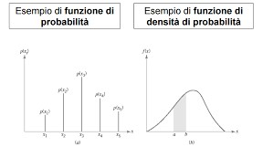
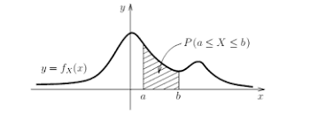

# Seconda parte

# Introduzione

L'indagine statistica è sempre effettuata su un insieme di entità (individui, oggetti,. . .) su cui si manifesta il fenomeno che si studia. Questo insieme è detto popolazione o universo e può essere costituito da un numero finito oppure infinito di unità; nel primo caso si parla di popolazione finita e nel secondo caso di popolazione illimitata. La conoscenza delle caratteristiche di una popolazione finita può essere ottenuta osservando la totalità delle entità della popolazione oppure un sottoinsieme di questa, detto campione estratto dalla popolazione. Una popolazione illimitata può invece essere studiata soltanto tramite un campione estratto dalla popolazione. Di particolare importanza in statistica è l'inferenza statistica. Essa ha lo scopo di estendere le misure ricavate dall'esame di un campione alla popolazione da cui il campione è stato estratto.

L'inferenza statistica si basa su due metodi fondamentali di indagine: la stima dei parametri e la verifica delle ipotesi.

### Stima dei parametri

La stima dei parametri ha lo scopo di determinare i valori non noti dei parametri di una popolazione (come il valore medio, la varianza,. . .) per mezzo dei corrispondenti parametri derivati dal campione estratto dalla popolazione (come la media campionaria, la varianza campionaria,. . .). Si possono usare stime puntuali o stime per intervallo.

Si parla di stima puntuale quando si stima un parametro non noto di una popolazione usando un singolo valore reale.

Alla stima puntuale di un parametro non noto di una popolazione (costituita da un unico valore) spesso si preferisce sostituire un intervallo di valori, detto intervallo di confidenza, ossia si cerca di determinare in base al campione osservato (x1, x2, . . . , xn) due limiti (uno inferiore e uno superiore) entro i quali sia compreso il parametro non noto con un certo grado di confidenza, detto anche grado di fiducia.

### Verifica delle ipotesi

La verifica delle ipotesi è un procedimento che consiste nel fare una congettura o un'ipotesi sul parametro non noto $\theta$ o sulla distribuzione di probabilità e nel decidere, sulla base del campione estratto se essa è accettabile.

## Variabili aleatorie discrete

Una variabile discreta può assumere un numero finito di valori reali (e, in tal caso, gli eventi elementari da cui deriva costituiscono l'elenco finito dei possibili risultati di una prova) oppure un numero infinito numerabile (e, in tal caso gli eventi elementari possono essere messi in corrispondenza con gli elementi della serie dei numeri naturali $1,2,…i,..$)

Un variabile discreta è nota se si conoscono i valori che può assumere e le rispettive probabilità, cioè se sono ordinatamente note le seguenti informazioni:

|                   |       |       |     |       |     |
|-------------------|-------|-------|-----|-------|-----|
| ***Valori di X*** | $x_1$ | $x_2$ | ... | $x_i$ | ... |
| ***Probabilità*** | $p_1$ | $p_2$ | ... | $p_i$ | ... |

La tabella precedente viene definita \*distribuzione della probabilità della variabile casuale discreta X e rappresenta un insieme di informazioni necessarie e sufficienti per calcolare la probabilità di qualsiasi evento concernente la v.c X.

Pertanto condizione necessaria e sufficiente affinché una v.c discreta X sia ben definita è che tali probabilità soddisfino le seguenti condizioni:

$$p_i ≥ 0, ∀_i = 1,2,...;$$

$$\sum_{i=1}^∞ p_i=1$$

Si noti che nessun vincolo viene imposto sui valori reali che una v.c può assumere. La rappresentazione grafica più naturale di una v.c. discreta è quella di porre in ascissa i valori $(x_i, x_2,…)$ che la v.c. può assumere ed in ordinata le corrispondenti probabilità $(p_1p_2,…)$, secondo la Figura seguente:

## Variabili aleatorie continue

Una variabile aleatoria è continua se può assumere tutti i valori compresi in un (qualsiasi) intervallo reale. Formalmente, una v.c. continua X è una funzione misurabile e a valori reali che assegna ad ogni evento di uno spazio di probabilità continuo un numero reale.

Le v.c. continue presentano una maggiore complessità analitica poiché per esse non è possibile elencare tutti i valori che la v.c. assume, essendo questi una infinità non numerabile. Occorre quindi assegnare la probabilità ad intervalli sulla retta e derivare,poi, da tale assegnazione tutte le probabilità degli eventi che interessano.

In prima istanza, tale assegnazione sembrerà astratta e poco collegata alla specifica prova ma, più oltre, si vedrà come l'introduzione di una probabilità per gli intervalli è strettamente derivata dalla natura e dalla specificità della prova.

Una v.c. continua X è nota se, per ogni $x_0$ reale e prefissato, è nota la probabilità che tale v.c. assuma un valore in un intervallo di ampiezza infinitesimo rispetto a $x_0$ mediante la relazione seguente:

$$P_r(x_0 < X ≤ x_0 + d_x) = f(x_0)dx$$

dove $f(x)$ è una funzione a valori reali, detta *funzione di densità* della v.c. continua X. Spesso, scriveremo: $X \sim f(x)$ per indicare che la v.c. X possiede $f(x)$ come propria funzione di densità.

La probabilità che la v.c X assuma valori nell'intervallo raffigurata è uguale a
